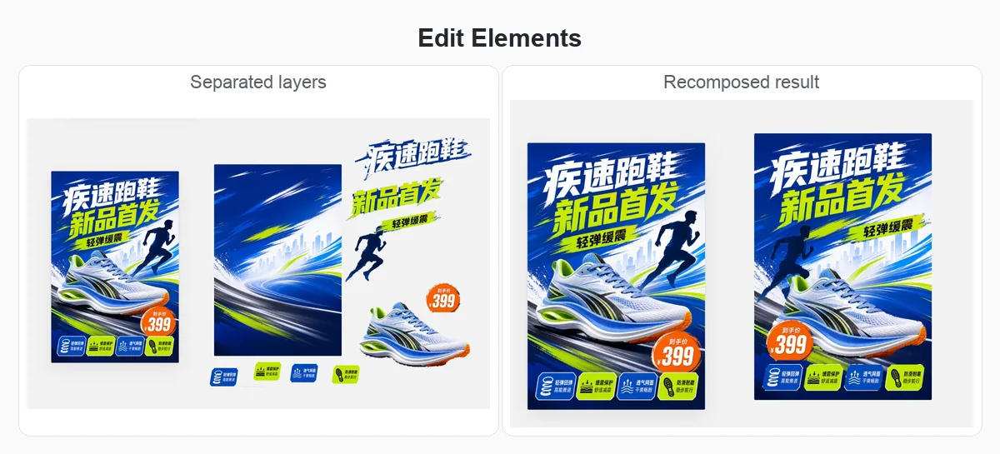
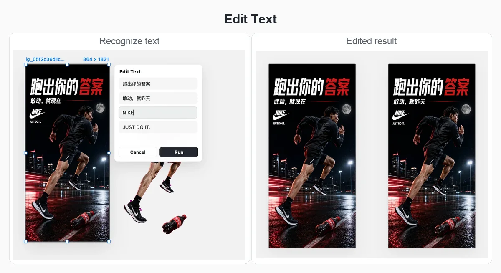

# Codex-Canvas

[中文](README.md) | [English](README.en.md) | [日本語](README.ja.md)

Codex-Canvas 是一个面向 Codex 的无限画布 Plugin，无需配置 API，调用 Codex 内置 GPT-image-2 实现画布编辑功能。它可以在 Codex 里打开画布，把生成的图片收录到当前项目中，并让你继续整理、标注、编辑、比较这些视觉资产。

这个插件把 Codex 变成更接近 Lovart 的工作形态：一边对话，一边画布，并参照 Lovart 画布提供许多强大的编辑功能。

<p align="center">
  
</p>

## 安装

把下面这段复制给 Codex：

```text
请根据 https://github.com/Xiangyu-CAS/codex-canvas.git 里的 INSTALL.md 安装 Codex-Canvas。
安装完成后，提示用户，在当前 Codex 对话里输入：`@Codex-Canvas 打开画布` 来启动
```

完整安装说明见 [`INSTALL.md`](INSTALL.md)。

安装完成后，在当前 Codex 对话里打开画布：

```text
@Codex-Canvas 打开画布
```

## Roadmap

- [x] GPT-image-2 图片编辑
- [ ] 可编辑 PPT 生成与导出
- [ ] draw.io 流程图生成与编辑

## 特色功能

### 1. 打开画布并自动收录生成图片

在当前 Codex 对话里输入 `@Codex-Canvas 打开画布`，Codex-Canvas 会在 in-app browser 中打开项目本地画布。左侧继续对话，右侧管理视觉资产。Codex/ImageGen 生成图片后，Codex-Canvas 会把图片持久化到当前项目，并自动放入当前画布，让生成结果直接进入可整理、可编辑的工作区。

<p align="center">
  
</p>

### 2. Quick Edit：用标注告诉模型怎么改

选中图片后可以直接进入 Quick Edit。画笔圈选、颜色、文字说明会一起作为编辑参考传给模型，适合做局部替换、增加元素、保留主体和版式的精修。

<p align="center">
  
</p>

### 3. Edit Elements：拆出元素继续重排

Edit Elements 可以把图片拆成背景、文字、商品、人物、价格标签等可移动图层。拆分后可以在画布上重排素材，也可以让后台继续补全被前景遮挡的背景层。下载任意一个拆分图层时，Codex-Canvas 会把同组图层一起导出为 PSD，方便继续交给 Photoshop、Photopea 等专业工具精修。

<p align="center">
  
</p>

### 4. Edit Text：识别并改写图片文字

Edit Text 会先识别图片里的文字，再把可编辑文本列出来。你可以逐行修改文案，并让模型尽量保持原有字体风格、版式关系和视觉氛围。

<p align="center">
  
</p>

### 5. Remove BG：一键去背景

对于海报、人像、商品图等素材，可以直接在画布中生成透明背景结果，并与原图并排比较。去背景后的结果仍然保留在同一个项目画布里，方便继续组合、排版或发送回 Codex 使用。

<p align="center">
  
</p>

### 6. Expand：按比例扩图和补全画面

Expand 支持可视化扩图框和常用比例预设，例如 1:1、3:4、16:9、9:16 等。你可以先决定新画幅，再让模型补全边缘内容，适合把竖版海报改成横版、方图或其他投放尺寸。

<p align="center">
  
</p>

## 功能

- 在 Codex 的 in-app browser 中打开本地无限画布。
- 自动收录 Codex/ImageGen 生成的图片到当前项目画布。
- 支持上传、导入、排列、选择、拖动、删除和下载画布图片。
- 支持在选中图片上画笔标注和临时文字标注。
- 支持 Quick Edit，并把标注颜色、文字标签等信息传给模型作为编辑参考。
- 支持图片去背景。
- 支持 Expand/outpaint，并提供可调整的扩图预览框。
- 支持 Edit Text；本地 OCR 可用时优先使用本地识别，不可用时回退到 Codex 视觉识别。
- 支持 Edit Elements，把图片拆成前景物体/文字图层和背景图层。
- 支持后台补全 Edit Elements 背景，并原位替换背景层。
- 支持将 Edit Elements 图层组下载为 PSD，每个画布图层对应一个 Photoshop 图层。
- 支持查看 prompt 历史和生成版本分组。
- 不同 Codex 对话可以使用不同画布，避免上下文混在一起。
- 支持复制选中图片的 `@file` 引用，粘贴到 Codex 聊天框中继续使用。

## 使用说明

Codex-Canvas 会把画布数据保存在当前项目的 `canvas/` 目录下。生成资产、任务日志和中间文件都会留在本地项目中。

`Send to chat` 目前还是通过 Codex app-server 提交的原型路径。它可以在协议层完成，但不保证一定出现在当前可见的 Codex 桌面端聊天 UI 中。更可靠的方式是使用 `Copy @file`，然后把引用粘贴到当前 Codex 聊天框。

## 开发

常用本地命令：

```bash
npm install
npm test
node ./bin/codex-canvas.mjs open --project .
```

相关文档：

- [`INSTALL.md`](INSTALL.md)：安装说明和可选本地依赖。
- [`docs/CANVAS_TO_CHAT.md`](docs/CANVAS_TO_CHAT.md)：当前 canvas-to-chat 的验证结果和限制。

## 致谢

感谢 [Cowart](https://github.com/zhongerxin/Cowart) 提供的画布思路
